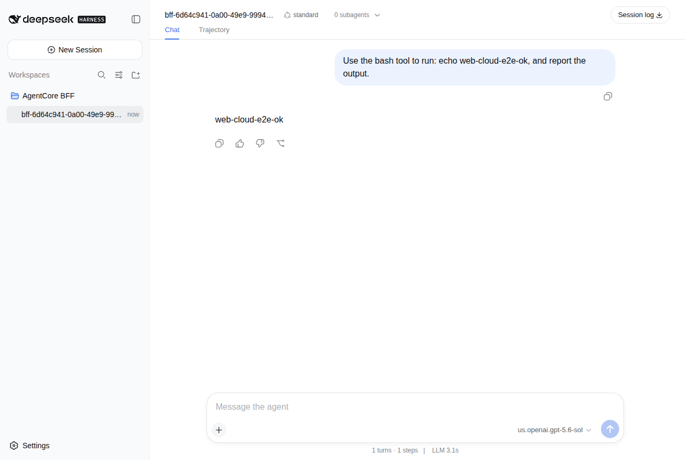
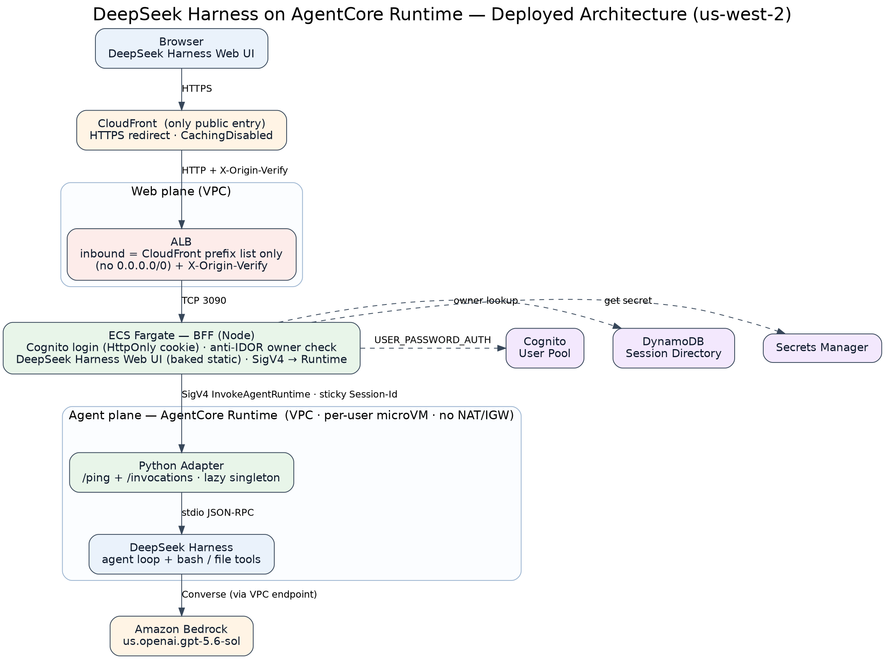

# DeepSeek Harness on Amazon Bedrock AgentCore Runtime

**English** · [中文](README.zh.md)

Host the open-source **DeepSeek Harness (DSH)** coding agent as a **multi-user, cloud coding
agent** on **Amazon Bedrock AgentCore Runtime** — keeping DSH's native Web UI, powered by
**Bedrock GPT** (`us.openai.gpt-5.6-sol`).

> The agent (model + `bash`/file tools) runs in a per-user AgentCore micro-VM. The browser keeps
> talking DSH's own Web protocol; a thin BFF bridges it to AgentCore and adds Cognito login +
> per-user isolation. **DSH itself is used unmodified** (out-of-tree adapter).

📄 **Full design doc** (with implementation notes & deviations merged in):
[docs/design-deepseek-harness-agentcore-runtime.md](docs/design-deepseek-harness-agentcore-runtime.md)



## Architecture



```
Browser (DSH Web UI)
  → CloudFront (HTTPS, the only public entry)
  → ALB (inbound = CloudFront prefix list only, + X-Origin-Verify)
  → ECS Fargate BFF  (Cognito login · HttpOnly cookie · Session Directory owner check · DSH static UI)
  → [SigV4 InvokeAgentRuntime]  AgentCore Runtime (VPC, per-user micro-VM, no NAT/IGW)
  → Python adapter (/ping + /invocations)  → DeepSeek Harness (agent loop + tools)  → Amazon Bedrock
```

**Two planes:**
- **Agent plane** — a self-contained ARM64 image bakes a prebuilt DSH runtime closure; a small
  Python adapter exposes the AgentCore contract (`/ping` + `/invocations`) and lazily launches DSH,
  which talks to Bedrock via DSH's `dsh-llm-pi-ai` `amazon-bedrock` provider.
- **Web plane** — a Node BFF serves DSH's Web UI (baked static), owns `/api/*` and the two downlink
  WebSockets, authenticates users with Cognito, enforces per-user ownership via a DynamoDB Session
  Directory, and calls the cloud Runtime with SigV4.

## Highlights

- **No fork of DSH** — everything is out-of-tree (Python adapter, custom cordis config, BFF).
- **Per-user isolation (anti-IDOR)** — `runtimeSessionId` is server-derived and never exposed to the
  browser; every request re-checks workspace ownership.
- **Security-first networking** — no `0.0.0.0/0`; CloudFront is the only public entry (HTTPS-only);
  the Runtime runs in a VPC with **no NAT/IGW** (only VPC endpoints → no arbitrary egress);
  least-privilege IAM (Bedrock invoke scoped to the model ARNs, no wildcards).
- **Secrets** live only in AWS Secrets Manager — never in git or image layers.

## Repository layout

| Path | What |
|---|---|
| `runtime/` | Python AgentCore adapter (`app.py`) + DSH launcher (`dsh_client.py`) + tests |
| `Dockerfile`, `scripts/build-image.sh` | Self-contained ARM64 Runtime image (bakes the DSH runtime closure) |
| `config/cordis.bedrock.yml` | DSH cordis config selecting the `amazon-bedrock` provider |
| `web-bff/` | Node BFF (Cognito login, Session Directory, SigV4→Runtime, DSH static UI) + `Dockerfile` |
| `docs/` | Design review, deviations, auth design, phase evidence |
| `alp/` | Architecture diagram + demo package |

## Build & run

**Runtime image (self-contained, no bind mount):**
```bash
bash scripts/build-image.sh            # builds a linux/arm64 image with the DSH runtime baked in
docker run -p 8080:8080 -e AWS_REGION=us-west-2 <image>   # /ping + POST /invocations {"prompt":"..."}
```

**Local dev (source mode):** point the adapter at a DSH checkout —
`DSH_RUNTIME_MODE=source DSH_REPO_ROOT=/path/to/deepseek-harness python3 runtime/app.py`.

**Cloud deploy:** ECR + `create-agent-runtime` (VPC mode), Cognito + DynamoDB, then the BFF on
ECS/ALB/CloudFront. All deployment-specific IDs are injected via env / Secrets Manager (not in git);
see `web-bff/README.md` for the required variables and `docs/PHASE2-runtime-deploy.md` +
`docs/auth-design.md` for the full recipe.

## Status

Phase 1 (local, real Bedrock) and Phase 2 (cloud deploy + identity + Web + browser e2e) are complete
and verified. Streaming `/ws`, global AgentCore Memory, hosted Web Search, and the full interaction
protocol (cancel/approval/subagents) are documented as follow-ups in `docs/design-deviations.md`.

## Notes

- Region `us-west-2`; model `us.openai.gpt-5.6-sol`.
- Deployment identifiers (account, VPC/subnet/SG, ARNs, URLs) are intentionally shown as
  `<PLACEHOLDER>` in this public repo.
- DSH is a separate upstream project, used unmodified.
